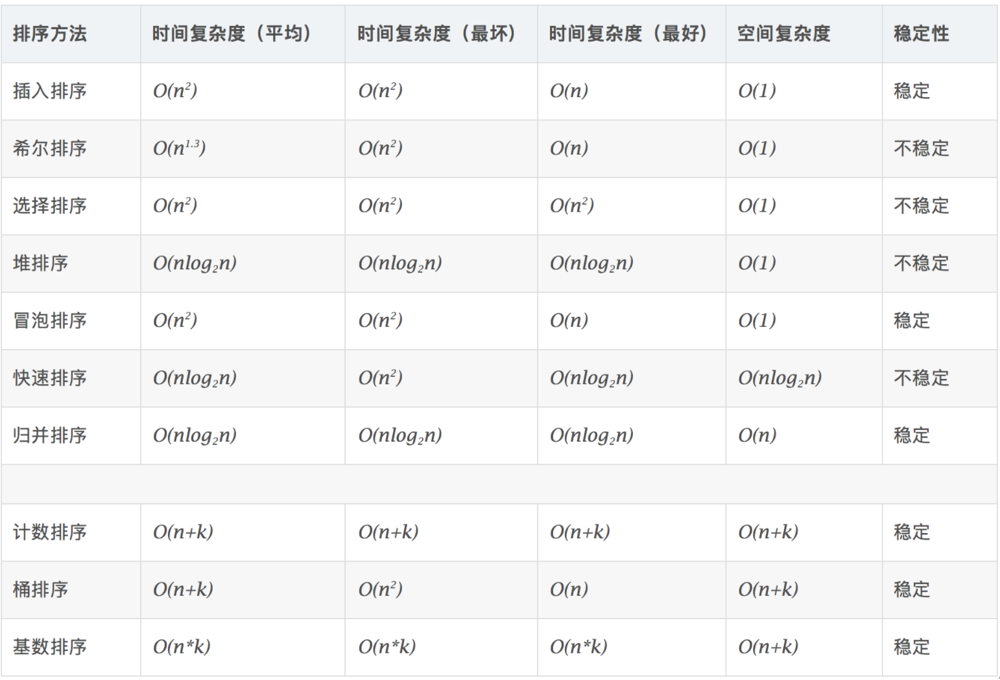

<h1 align='center'> 常见排序 </h1>

###### 插入排序：

​				直接插入

​				希尔排序

###### 交换排序：	

------

​				冒泡排序

​				快速排序

------

###### 选择排序：

​				简单选择排序

​				堆排序

------

###### 归并排序：

​				归并排序

------

###### 基数排序：		

​				基数排序

------

###### 计数排序：		

​				计数排序

------

###### 桶排序：		

​				桶排序

------

